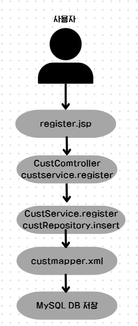
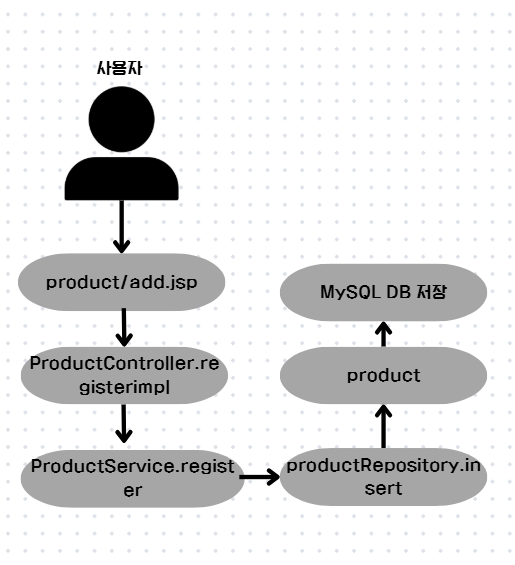
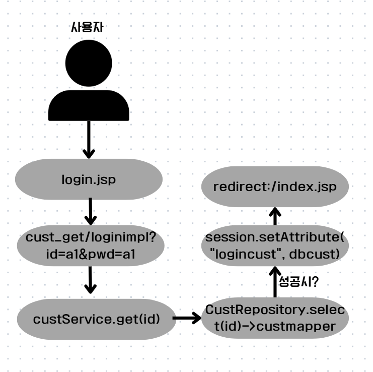
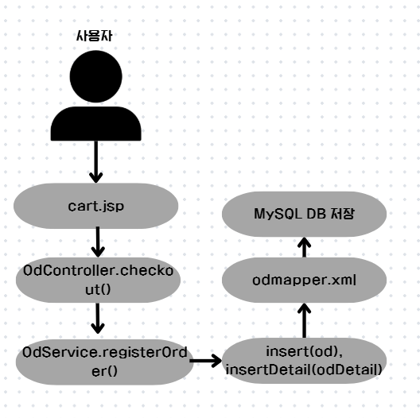
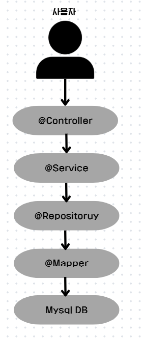
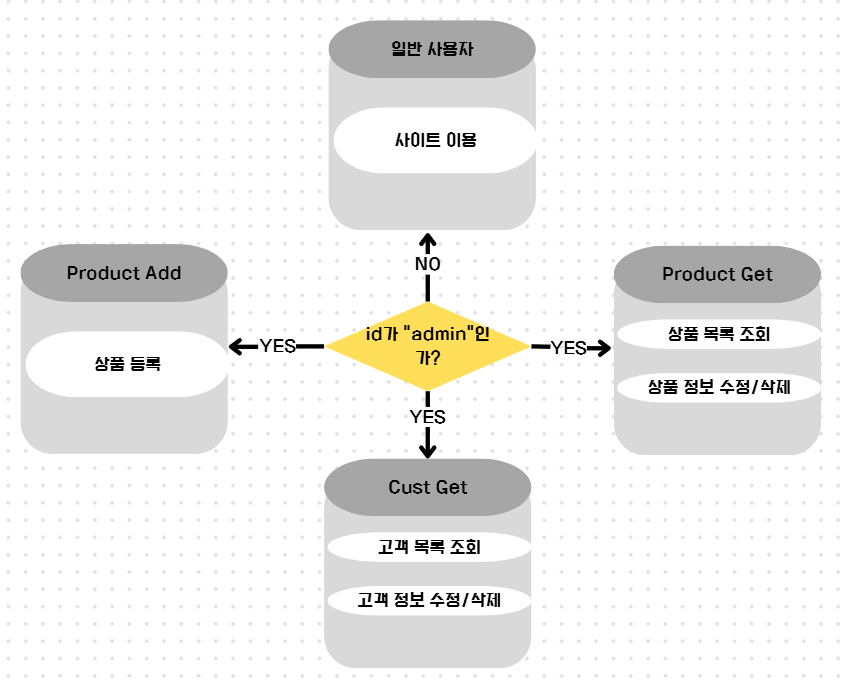

# 🛒 쇼핑몰 웹 애플리케이션 (Spring Boot)

스프링 부트 기반으로 개발한 **액세서리 쇼핑몰**입니다.  
회원 가입, 로그인, 상품 조회, 장바구니, 주문, 관리자 기능을 포함하며, MyBatis와 MySQL로 데이터 연동을 처리했습니다.

---

## 📋 조원 정보

- **개발자**: 이다온, 이승호
- **GitHub**: [sm25_Accecary_shop](https://github.com/lsh030412/sm25_Accecary_shop)

---

## 🏗️ 기술 스택

| 구분         | 기술                                    |
|--------------|-----------------------------------------|
| Back-end     | Java 17, Spring Boot, Spring MVC, MyBatis |
| Database     | MySQL 8.x                               |
| Front-end    | JSP, JSTL, Bootstrap, jQuery            |
| 빌드 도구     | Gradle                                  |
| 개발 환경     | IntelliJ IDEA                           |

---

## ✨ 주요 기능 & 흐름

### 1. 회원 기능
- **회원가입**, **로그인/로그아웃**
- **내 정보 수정**, **회원 탈퇴**
- **관리자 계정** 분리



> **흐름**: `register.jsp` → `CustController.register` → `CustService.register` → `CustRepository.insert` → `custmapper.xml` → MySQL

---

### 2. 상품 기능
- **카테고리별 상품 조회**, **상품 상세 보기**
- **상품 등록/수정/삭제** (관리자)
- **이미지 업로드/수정**, **할인율 적용**



> **흐름**: `product/add.jsp` → `ProductController.registerImpl` → `ProductService.register` → `ProductRepository.insert` → `productmapper.xml` → MySQL

---

### 3. 로그인 기능
- **로그인 검증** 및 **세션 저장**
- 로그인 성공 시 `sessionScope.logincust`에 고객 정보 보관



> **흐름**: `login.jsp` → `CustController.loginImpl` → `CustService.get` → `CustRepository.select` → `custmapper.xml` → MySQL → redirect `/index`

---

### 4. 장바구니 기능
- **장바구니 담기/삭제**, **수량 변경**
- **결제 페이지**로 이동



> **흐름**: `cart.jsp` → `OdController.checkout` → `OdService.registerOrder` → `OdRepository.insert` & `insertDetail` → `odmapper.xml` → MySQL

---

### 5. 주문 기능
- **주문 생성**, **주문 상세 조회**
- **가상 결제** (고객 잔액 차감)



> **흐름**: `Controller` → `Service` → `Repository` → `Mapper(XML)` → MySQL

---

### 6. 관리자 기능
- **상품 관리**: 등록/수정/삭제
- **회원 관리**: 전체 회원 조회, 수정, 탈퇴
- **주문 관리**: 주문 내역 조회 및 처리



> **흐름**: `admin` 계정 로그인 후 모든 관리 메뉴 접근 가능

---

## 💾 DB 테이블

| 테이블명       | 설명              |
|----------------|-------------------|
| `cate`         | 카테고리          |
| `cust`         | 고객 정보         |
| `product`      | 상품 정보         |
| `cart`         | 장바구니          |
| `orders`       | 주문 헤더         |
| `orderdetail`  | 주문 상세         |


---

## 🚀 실행 & 접속

```bash
./gradlew bootRun